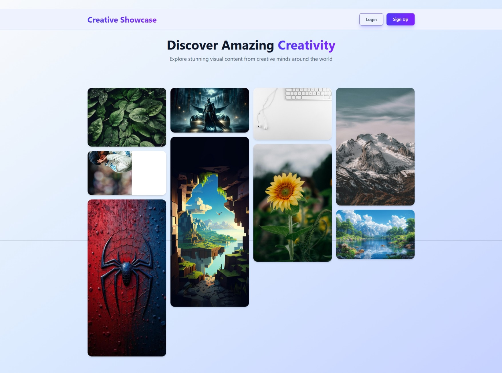
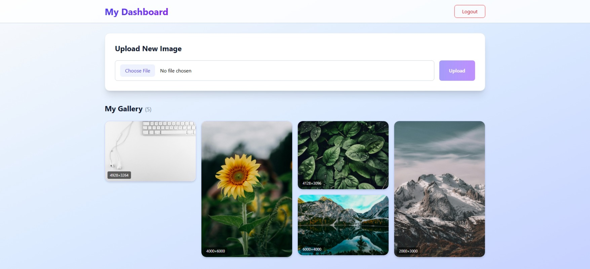

#  Creative Showcase

Creative Showcase is a full-stack web application that allows users to upload, explore, and showcase creative images in a visually appealing **masonry (mosaic) layout**, similar to platforms like Pinterest or Unsplash.

It supports **public user profiles**, **random image discovery**, and a **personal dashboard** for managing uploads.

---

## Features
### Public Features
- Landing page with **randomly displayed images**
- Pinterest-style **masonry / mosaic gallery**
- **Public user profiles** accessible via `/profile/:username`
- View all images uploaded by a specific user
- Fully responsive design

### 🔐 Authenticated Features
- User authentication (Signup / Login)
- Personal dashboard
- Upload images
- Delete uploaded images
- View image dimensions
- Secure JWT-based access

---

## Tech Stack

### Frontend
- React (Vite)
- React Router
- Tailwind CSS
- Axios

### Backend
- Node.js
- Express.js
- MongoDB (Mongoose)
- JWT Authentication
- Multer (Image Upload)

### Deployment
- Frontend: Vercel
- Backend: Render
- Database: MongoDB Atlas

---
## Run Locally

### Backend
```bash
cd server
npm install
npm run dev
```

### Frontend
```bash
cd client
npm install
npm run dev
```

---

## 📸 Screenshots

### Landing Page


### Dashboard


---

## 📁 Project Structure

```
Creative_Showcase/
├── server/
│   ├── src/
│   │   ├── controllers/
│   │   ├── models/
│   │   ├── routes/
│   │   ├── middlewares/
│   │   └── index.js
│   ├── uploads/
│   └── package.json
├── client/
│   ├── src/
│   │   ├── pages/
│   │   ├── components/
│   │   ├── utils/
│   │   └── main.jsx
│   └── package.json
└── README.md
```

---


### Author

Dhiraj Sah

---

